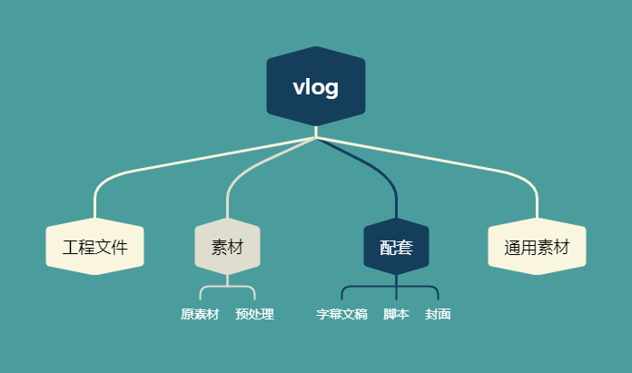

# vlog处理工具

预期解决痛点
1. 初始化项目文件夹
2. 数据拷贝并校验
3. 素材压缩
4. 备份到云盘等

## 项目初始化
针对vlog优化的目录

预计处理方式：  
使用配置文件，例如json、yaml或者toml来配置初始化文件夹。

## 数据拷贝校验

自动复制到origin目录下，通过哈希校验确保数据完整性。

## 素材压缩
压缩参数：  
`x264 --crf 24 --preset 8 -r 6 -b 6 -I infinite -i 1 --scenecut 60 -f 1:1 --qcomp 0.5 --psy-rd 0.3:0 --aq-mode 2 --aq-strength 0.8 --vf resize:768,432,,,,lanczos -o "%~dpn1_v.mp4" "%~1”`

原文章已经失效，此处放上搬运文章  
[《尽量不浪费压制时间的简单视频高压要点》](https://www.bilibili.com/opus/677444152376426502)

## 备份

- [ ] 对象存储
- [ ] 阿里云盘
- [ ] Onedrive